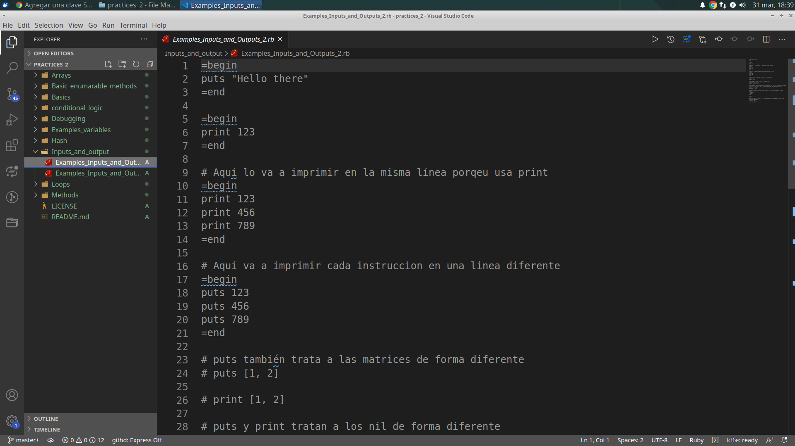

?style=plastic&logo=ruby)

# Practices - Ruby

> Create this Github repository in order to carry out educational practices related to the Ruby Programming Language.

Practices - [Ruby](https://ruby-doc.org/)
This project is carried out for educational purposes for learning the Ruby programming language.

## Built With

?style=plastic&logo=ruby)

## Live Demo

[Live Demo Link](https://aristides1000.github.io/html_css_capstone_online_shop_travel_agency/)

## Getting Started

This project was created with the purpose of studying Ruby.

### Prerequisites

Computer running [Mac OS](https://www.apple.com/macos/big-sur/), [Windows](https://www.microsoft.com/en-us/software-download/windows10), or [Linux Ubuntu](https://ubuntu.com/download). [Web browser](https://en.wikipedia.org/wiki/Web_browser): [Firefox](https://www.mozilla.org/en-US/firefox/new/), [Google Chrome](https://www.google.com/intl/en/chrome/), [Opera](https://www.opera.com/x-en-b)...

### Install

Getting Started
To get a local copy up and running follow these simple example steps:

- You need to [clone](https://docs.github.com/en/github/creating-cloning-and-archiving-repositories/cloning-a-repository) or [download as zip file](https://www.itprotoday.com/mobile-management-and-security/how-do-i-download-files-github) the repository on your device.
- [Unzip](http://www.e7z.org/open-zip.htm) the repository or just clone it using git or github.
- [Grab the index.html file and open it on your favorite browser.](https://helpdeskgeek.com/how-to/open-an-html-file-in-google-chrome/)
- If you want to see the source code of the files located in my repository, you can do it through a [code editor of your choice](https://www.elegantthemes.com/blog/resources/best-code-editors), I recommend using [VSCode](https://code.visualstudio.com/), first, you must [install it by following these steps](https://code.visualstudio.com/docs), then you must [open the folder containing my repository in your local repository](https://thisdavej.com/right-click-on-windows-folder-and-open-with-visual-studio-code/#:~:text=You%20can%20now%20navigate%20to,with%20VS%20Code%E2%80%9D%20as%20well.) and [open each of the files](https://code.visualstudio.com/docs/editor/editingevolved) to see their content.
- If you have any questions or problems about how to run this project, you can leave me a comment in the [issues section](https://github.com/aristides1000/using-bootstrap/issues) of this repository, I am more than willing to help you.

### Usage
Run the files contents in the Repo.

### Run tests
Linters errors

## Authors

👤 **Author1**
Aristides Jose Molina Pérez

- GitHub: [@aristides1000](https://github.com/aristides1000)
- Twitter: [@aristides_1000](https://twitter.com/@aristides_1000)
- LinkedIn: [aristides jose molina perez](https://www.linkedin.com/in/aristides-jose-molina-perez-09b0579a)

## 🤝 Contributing

Contributions, issues, and feature requests are welcome!

Feel free to check the [issues page](https://github.com/aristides1000/Ruby_Practices/issues).

## Show your support

Give a ⭐️ if you like this project!

## License

This project is [CC0-1.0](LICENSE) licensed.

## Acknowledgments

- Ariel Camus CEO Microverse: For letting us start this journey.
- Google: For letting us find crucial information in order to create this project.
